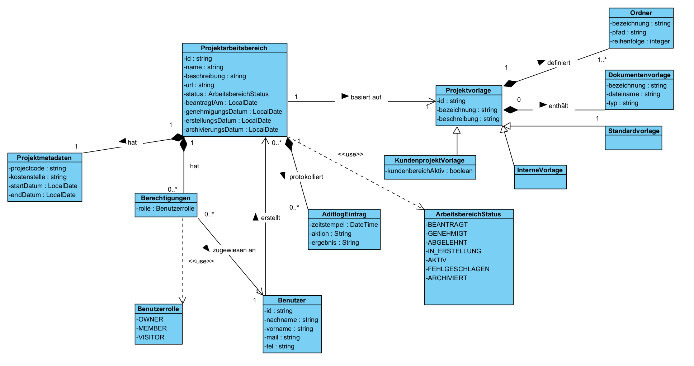

# Architektur

Enthält alle Dokumente zur Systemarchitektur:
- Systemkontextdiagramm
- Komponentendiagramme
- Datenmodelle
- Schnittstellenbeschreibungen (Microsoft Graph API, SharePoint, Entra ID)

## Klassendiagramm

Das Klassendiagramm zeigt die Kernklassen des Project-Workspace-Managers mit ihren Attributen und Beziehungen:

| Klasse | Beschreibung |
|---|---|
| `ProjektArbeitsbereich` | Zentrale Entität mit Status, Antrags- und Genehmigungsdaten |
| `Projektmetadaten` | Projektnummer, Kostenstelle, Start- und Enddatum |
| `Berechtigungen` | Zugriffskontrolle (Benutzerrolle) |
| `Benutzerrolle` | Enum: OWNER, MEMBER, VISITOR |
| `Benutzer` | Benutzerstammdaten (Name, Mail, Tel) |
| `AuditLogEintrag` | Protokollierung aller Aktionen mit Zeitstempel und Ergebnis |
| `ArbeitsbereichStatus` | Enum: BEANTRAGT, GENEHMIGT, ABGELEHNT, IN_ERSTELLUNG, AKTIV, FEHLGESCHLAGEN, ARCHIVIERT |
| `ProjektVorlage` | Basis-Vorlage mit Bezeichnung und Beschreibung |
| `KundenprojektVorlage` | Spezialisierung mit externem Kundenbeitragsadmin-Flag |
| `InterneVorlage` | Spezialisierung für interne Projekte |
| `Ordner` | Ordnerstruktur mit Pfad und Reihenfolge |
| `DokumentenVorlage` | Vorlagendateien (Dateiname, Typ) |
| `StandardVorlage` | Standarddokumentenvorlage |
